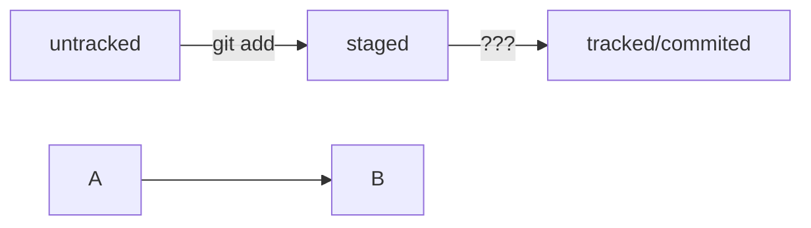

##### небольшие заметки насчет удаленого и локального репозитория

чтобы начать отслеживать изменения в какой-либо папке, нам надо выбрать/создать папку и использовать команду _git init_.  
так мы инициализируем пустой репозиторий git (вопрос заключается в том, что если мы будем проводить инициализацию, когда папка будет не пуста?)

----

далее мы создаем удаленый репозиторий на сайте удаленных репозиториев, как бы это не звучало бы логично, но я не знал, что их много :)

----

наверное, это было самое простое для понимания, так как дальше нам надо всего то навсего надо настроить связь между этими репозиториями. 
Передаваемые данные, даже мне понятно, что нужно зашифровать, поэтому здесь используются ключи один из которых шифрует, а второй расшифровывает. 
Тот, который шифрует, он публичный, а второй только ваш и не с кем делиться им нельзя.
Ключи генерируются командой _ssh-keygen -t (далее указывается тип шифрования что ли) ed25519 (не помню зачем остальное) -С 'ваша почта'_. 
А еще все это мы делаем в домашней директории (в дальн. буду сокращать дд). 
После генерации в **дд** будет создан невидимый ~~файл~~ папка с расширением .ssh в которой и лежат ключи. 
Можно скопировать внутренности публичного ключа командой _clip ~/.ssh/id_ed25519.pub_ (надо будет попробовать скопировать приватный).
этот ключ вставляется на сайте удаленого репозитория, у меня гитхаб поэтому нажимаю на свой аккаунт в правом верхнем углу, выплывает меню, нажимаю settings, дальше ssh gpg keys --> new ssh key --> все параметры оставляю как есть и создаю ключ. 
Далее следует команда, которую я не особо понимаю, _ssh -T (обязательно в верхнем, иначе пишет билиберду) git@github.com_. 
после этой команды вылезет предупреждение, если вы никогда не соединялись с сервером введеного сайта. 
Сервер сайта сгенерирует ключ SHA256 и заходим на официальный сайт, например, гитхаб в моем случае, а точнее в разделе Authentication/Account security/SSh key fingerprints.
Если они ключ sha в bash совпадает с тем, что на сайте, значит сервер действительный. В обучении писали, что будет привествие, но у меня его в первый раз не было.

----

Определю последний момент, который сложно было запомнить.
Нам надо привязать **ур** к **лр** командой _git remote add_. Переходим на страницу **ур**, выбираем тип ssh и копируем url.
К выше названной команде добавляем origin и скопированный url (вообще этой команде необходимо передать два параметра: имя **ур** и его url). 
Origin - это стандартный псевдоним, с помощью которого можно обращаться к главному ур
Чтобы убедиться, что репозитории связаны, используем команду git remote -v. В выводе будут 2 строки, которые подтверждают связь (честно говоря, там ничего о налаживании связи не говорит)

----

## Хеширование

Данные можно преобразовывать в отпечаток (fingerprint) с помощью хеширования. В git данные хешируются алгоритмом SHA-1. 
Такой хеш обладает следующими свойствами:
* если хешировать одни и те же данные два раза, то хеш будет одинаковый
* если хоть что-то в данных изменить, то хеш **сильно** изменится

По хешу можно получить основные данные коммита: автора, дату коммита, содержимое закоммиченных файлов.
Все хеши и таблица соответствий хранятся в скрытой папке .git

## Логи

После вызова git log появляется список коммитов. Каждое описание содержит:
* хеш коммита
* имя автора и эл. почту
* дату и время создания коммита
* сообщение коммита

Можно получить сокращенный лог командой git log --oneline
В таком случае, будут показаны первые несколько символов хеша коммитов и их комментарии.

## Файл HEAD

Этот файл указывает на коммит, который был сделан последним.
Это один из служебных файлов папки .git. Внутри head ссылка на служебный файл refs/heads/master

## Статусы файлов в git 

* untracked (все новые файлы помечаются данным статусом. Гит видит, что файл существует, но не следит за его изменениями) 
* staged (после команды git add файл попадает в staging area/index/cache, то есть список файлов, которые войдут в коммит. Состояние файла staged)
* tracked (противоположность untracked)
* modified (состояние присваивается файлу, если у последней сохраненой версии и текущей есть различия)

## Жизненный цикл файла в git

1. Файл только что создали. Состояние: untracked
2. Файл добавили в staging area с помощью команды git add. Состояние staged( +tracked)
3. Сделали коммит git commit. Состояние: tracked 
4. Изменили файл. Состояние: modified (+ tracked)

----

Jira - система для организации проектов и задач. У каждой задачи есть идентификатор, например, LGS-239 (239 задача в проекте LGS)
В корпоративном стиле, сначала указывают Jira-ID, а потом текст сообщения.

----

Стандарт conventional commits предлагает такой формат коммита: <type>: <сообщение>, где type:
* feat - для новой функциональности 
* fix - для исправления ошибок 
Например, ```git commit -m "feat: добавить подсчет суммы заказов за неделю"```

----

GitHub можно использовать для ведения списка задач проекта. Если коммит решает какую-то задачу, то в сообщении удобно указывать ссылку на нее. 
Например, ```git commit -m "Исправить #334, добавить график температуры"```  

##### для сообщений на русском рекомендуют использовать инфинитивы: добавить тесты.., исправить ошибку.. Для сообщений на английском рекомендуется повелительное наклонение: use library mega_lib_300, fix exit button




